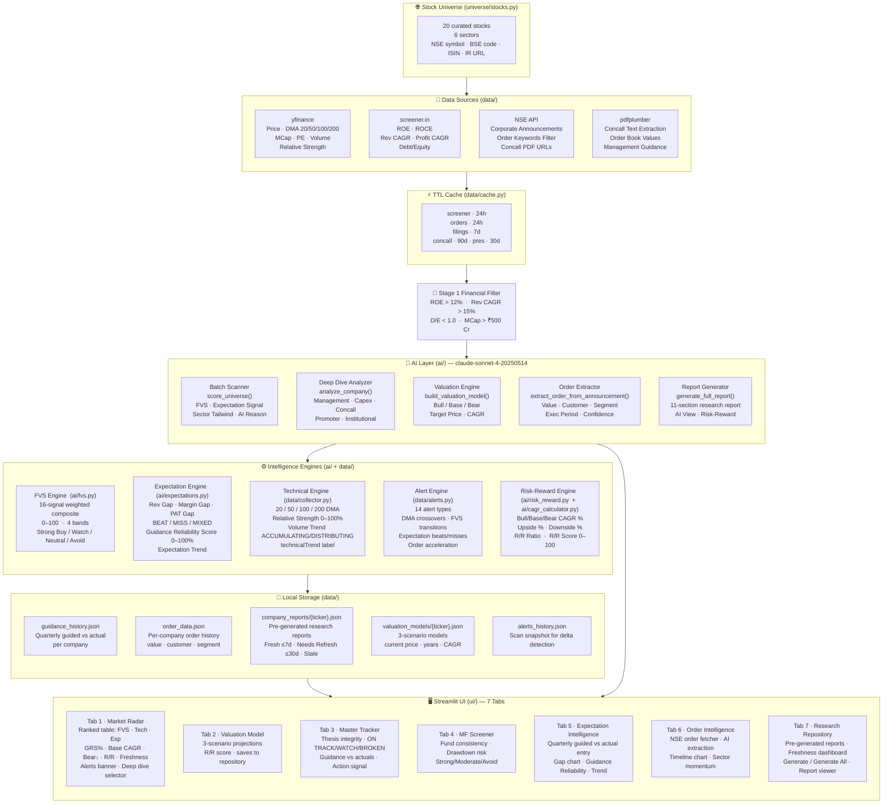
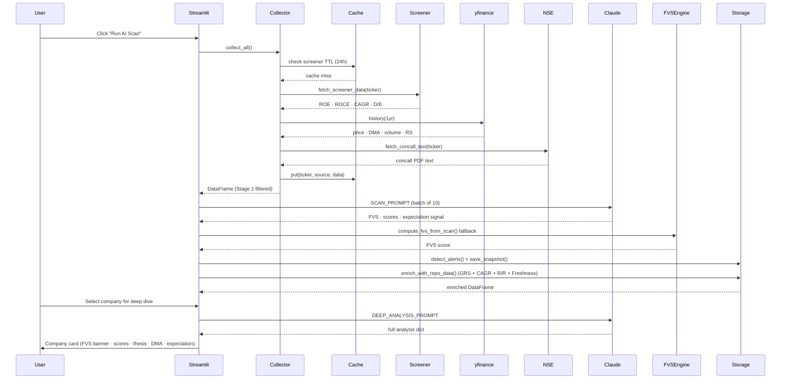
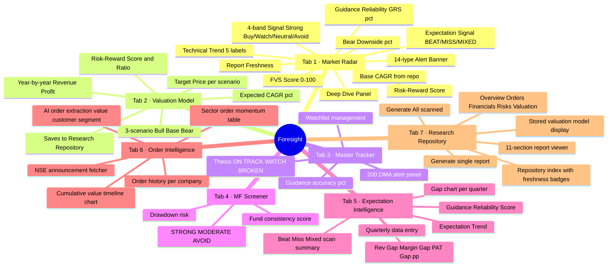

# Foresight — Architecture & Feature Map
### Single Source of Truth · Last updated 2026-05-22

---

## 1. System Architecture Overview



---

## 2. Data Flow — from Universe to Insight



---

## 3. Spec Coverage Matrix

| Feature | Spec Source | Status | File(s) |
|---|---|:---:|---|
| Stock Universe (20 stocks, 6 sectors) | CLAUDE.md | ✅ | `universe/stocks.py` |
| BSE code · ISIN · IR URL per stock | Research Repo Spec §5 | ✅ | `universe/stocks.py` |
| yfinance financial data fetch | CLAUDE.md | ✅ | `data/collector.py` |
| screener.in scraping (ROE, ROCE, CAGR) | CLAUDE.md | ✅ | `data/scraper.py` |
| TTL-based JSON cache | v2.0 Spec §6.2 | ✅ | `data/cache.py` |
| Stage 1 financial filter | CLAUDE.md | ✅ | `data/collector.py` |
| Rotating user-agents + random delays | v2.0 Spec §6.1 | ✅ | `data/scraper.py` |
| NSE concall PDF scraping | v2.0 Spec S16 | ✅ | `data/scraper.py` + `data/pdf_extractor.py` |
| **FVS Engine (0–100, 16 signals)** | v2.0 Spec §S18 | ✅ | `ai/fvs.py` |
| Claude batch scan scoring | CLAUDE.md | ✅ | `ai/analyzer.py` |
| Deep-dive company analysis | CLAUDE.md | ✅ | `ai/analyzer.py` |
| Management consistency scoring | v2.0 Spec | ✅ | `ai/prompts.py` |
| Capex expansion detection | v2.0 Spec S08 | ✅ | `ai/prompts.py` |
| Export opportunity signal | v2.0 Spec S09 | ✅ | `ai/prompts.py` |
| Working capital stress flags | v2.0 Spec S12 | ✅ | `ai/prompts.py` |
| Promoter + institutional signals | v2.0 Spec S14-S15 | ✅ | `ai/prompts.py` |
| Concall sentiment analysis | v2.0 Spec S16 | ✅ | `ai/prompts.py` |
| Concentration risk banner | v2.0 Spec S19 | ✅ | `ui/company_card.py` |
| **20/50/100/200 DMA tracking** | v3.0 Spec §5 | ✅ | `data/collector.py` |
| Relative Strength (0–100%) | v3.0 Spec §5 | ✅ | `data/collector.py` |
| Volume trend ACCUMULATING/DISTRIBUTING | v3.0 Spec §5 | ✅ | `data/collector.py` |
| Technical Trend label | v3.0 Spec §5 | ✅ | `data/collector.py` |
| **Expectation Gap (Rev/Margin/PAT pp)** | v3.0 Spec §4 | ✅ | `ai/expectations.py` |
| Beat / Miss / Mixed classification | v3.0 Spec §4 | ✅ | `ai/expectations.py` |
| Guidance Reliability Score (0–100%) | v3.0 Spec §4 | ✅ | `ai/expectations.py` |
| Expectation Trend (Improving/Deteriorating) | v3.0 Spec §4 | ✅ | `ai/expectations.py` |
| Quarterly data entry (Tab 5) | v3.0 Spec §4 | ✅ | `ui/expectation_tab.py` |
| **Alert Engine (14 alert types)** | v3.0 Spec §3.5 | ✅ | `data/alerts.py` |
| DMA crossover alerts | v3.0 Spec §3.5 | ✅ | `data/alerts.py` |
| FVS transition alerts | v3.0 Spec §3.5 | ✅ | `data/alerts.py` |
| AI Explanation column | v3.0 Spec §6.3 | ✅ | `ai/prompts.py` + `ui/dashboard.py` |
| GRS % in Market Radar table | v3.0 Spec §6 | ✅ | `ui/dashboard.py` |
| **BSE/NSE Order Parser** | Research Repo Spec §6 | ✅ | `data/order_fetcher.py` |
| Order value · customer · segment extraction | Research Repo Spec §6.4 | ✅ | `ai/analyzer.py` (ORDER_EXTRACTION_PROMPT) |
| Per-company order history | Research Repo Spec §7 | ✅ | `data/order_history.py` |
| Order timeline chart | Research Repo Spec §7 | ✅ | `ui/order_tab.py` |
| Sector order momentum view | Research Repo Spec §7 | ✅ | `ui/order_tab.py` |
| **Quarterly OB extraction (PDF)** | Research Repo Spec §8 | ✅ | `data/pdf_extractor.py` |
| **Pre-generated Research Reports** | Research Repo Spec §9 | ✅ | `data/report_repository.py` |
| Report freshness (Fresh/Needs Refresh/Stale) | Research Repo Spec §9.4 | ✅ | `data/report_repository.py` |
| Full report generator (11 sections) | Research Repo Spec §9.3 | ✅ | `ai/analyzer.py` (FULL_REPORT_PROMPT) |
| **3-Scenario Valuation Engine** | Research Repo Spec §10 | ✅ | `ai/analyzer.py` + `ui/valuation_tab.py` |
| **Expected CAGR Calculator** | Research Repo Spec §11 | ✅ | `ai/cagr_calculator.py` |
| Bull/Base/Bear CAGR + Upside/Downside % | Research Repo Spec §11 | ✅ | `ai/cagr_calculator.py` |
| **Risk-Reward Engine (0–100 score)** | Research Repo Spec §12 | ✅ | `ai/risk_reward.py` |
| Risk-Reward ratio | Research Repo Spec §12 | ✅ | `ai/risk_reward.py` |
| Base CAGR · Bear ↓ · R/R in main table | Research Repo Spec §14 | ✅ | `ui/dashboard.py` |
| Report Freshness in main table | Research Repo Spec §14 | ✅ | `ui/dashboard.py` |
| CAGR · R/R · GRS · Freshness filters | Research Repo Spec §14.3 | ✅ | `ui/filters.py` |
| Demo mode (8 companies, no API key) | Internal | ✅ | `data/demo.py` |
| Token usage logger | Internal | ✅ | `ai/token_logger.py` |
| 3-scenario valuation saved to repository | Research Repo Spec §13 | ✅ | `ui/valuation_tab.py` |
| **Notifications / Alerts (email/push)** | Deferred | ⏳ | Pending user request |
| Universe expansion (>20 stocks) | Research Repo Spec §17.3 | ⏳ | Pending |
| Scheduled auto-refresh | Research Repo Spec §17.3 | ⏳ | Pending |
| PDF report export | Internal | ⏳ | Pending |

---

## 4. Tab Feature Map



---

## 5. File Structure

```
c:\Foresight\
│
├── main.py                         ← Streamlit entry point (7 tabs)
├── .env                            ← ANTHROPIC_API_KEY (never committed)
│
├── universe/
│   └── stocks.py                   ← 20 stocks · NSE · BSE · ISIN · IR URL
│
├── data/
│   ├── collector.py                ← yfinance fetch + DMA + RS + volume trend
│   ├── scraper.py                  ← screener.in + NSE concall scraper
│   ├── pdf_extractor.py            ← pdfplumber concall + order book extraction
│   ├── cache.py                    ← TTL JSON cache (5 source types)
│   ├── alerts.py                   ← 14-type alert engine + snapshot store
│   ├── guidance_history.py         ← Quarterly guided vs actual persistence
│   ├── order_fetcher.py            ← NSE order announcement fetcher
│   ├── order_history.py            ← Per-company order JSON store
│   ├── report_repository.py        ← Pre-generated report + valuation store
│   └── demo.py                     ← 8 demo companies + orders + reports + alerts
│
├── ai/
│   ├── prompts.py                  ← All Claude prompt templates (6 prompts)
│   ├── analyzer.py                 ← Claude API calls (7 functions)
│   ├── fvs.py                      ← FVS composite engine (16 signals)
│   ├── expectations.py             ← Expectation gap + GRS + trend engine
│   ├── cagr_calculator.py          ← Expected CAGR from scenarios
│   ├── risk_reward.py              ← R/R score 0-100 + ratio + label
│   └── token_logger.py             ← Per-call token tracking + session summary
│
├── ui/
│   ├── dashboard.py                ← Tab 1 · Market Radar
│   ├── valuation_tab.py            ← Tab 2 · Valuation Model
│   ├── tracker_tab.py              ← Tab 3 · Master Tracker
│   ├── mf_tab.py                   ← Tab 4 · MF Screener
│   ├── expectation_tab.py          ← Tab 5 · Expectation Intelligence
│   ├── order_tab.py                ← Tab 6 · Order Intelligence
│   ├── repository_tab.py           ← Tab 7 · Research Repository
│   ├── company_card.py             ← Deep dive panel (FVS banner · DMA · Exp)
│   └── filters.py                  ← Sidebar filters + apply_filters()
│
└── data/  (runtime generated)
    ├── cache/                      ← {ticker}_{source}_{date}.json
    ├── company_reports/            ← {ticker}.json  pre-generated reports
    ├── valuation_models/           ← {ticker}.json  3-scenario models
    ├── guidance_history.json       ← Quarterly expectation history
    ├── order_data.json             ← Order announcement history
    └── alerts_history.json         ← Previous scan snapshot
```

---

## 6. Investment Signal Flow

```mermaid
flowchart LR
    subgraph INPUT["Raw Inputs"]
        I1["Financial ratios\nROE · ROCE · CAGR · D/E"]
        I2["Market data\nPrice · DMA · Volume · RS"]
        I3["Order book\nOB/Rev · Inflow trend"]
        I4["Management signals\nConcall · Guidance · Capex"]
        I5["Expectation data\nGuided vs Actual\n(user entered)"]
        I6["Order announcements\nNSE corporate filings"]
    end

    subgraph SIGNALS["16 FVS Signals + Expectation"]
        S1["Business Quality\nROE · ROCE · CAGR · D/E"]
        S2["Order Visibility\nOB/Rev · Inflow acceleration"]
        S3["Sector Tailwind\nGovt policy · PLI · sector score"]
        S4["Technical Trend\n200/100/50/20 DMA position\nRS · Volume"]
        S5["Management Quality\nConsistency score\nCapex · Export"]
        S6["Expectation Gap\nBEAT/MISS/MIXED\nGRS %"]
    end

    subgraph COMPOSITE["Composite Scores"]
        FVS["FVS  0–100\n4-band ranking"]
        RR["Risk-Reward\n0–100 score\nRatio · Label"]
        GRS["Guidance Reliability\n0–100%\nTrend"]
    end

    subgraph OUTPUT["Investment Decision Support"]
        O1["Strong Buy ≥80\nWatch 60-79\nNeutral 40-59\nAvoid <40"]
        O2["Base CAGR %\nBear Downside %\nBull Upside %"]
        O3["Alerts\n14 trigger types"]
        O4["Research Report\n11 sections\nAI View"]
    end

    INPUT --> SIGNALS --> COMPOSITE --> OUTPUT
```



---

## 7. Pending Features (Backlog)

| Feature | Priority | Notes |
|---|:---:|---|
| 📧 Email / push notifications on FVS ≥80 or new order | High | User will request — Alert Engine already built, just needs delivery layer |
| 🌐 Universe expansion (50–100 stocks) | Medium | Add tickers to `universe/stocks.py` |
| 🔄 Scheduled auto-refresh (weekly scan + report regen) | Medium | Windows Task Scheduler or cron |
| 📄 PDF report export | Low | WeasyPrint or ReportLab on top of existing report data |
| 📊 Historical FVS trend chart per company | Low | Store FVS snapshots over time |
| 🔬 Multibagger pattern matching | Low | v2.0 Spec S17 — compare to HAL 2018-style setups |

---

*Generated from CLAUDE.md · foresight_expectation_intelligence_engine_spec__v3.md · foresight_company_research_repository_and_valuation_spec.md*
